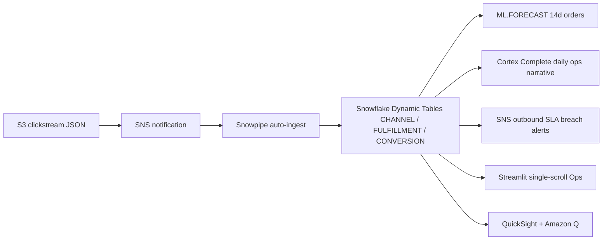

# Omnichannel Analytics — Ops Command Center

Real-time operations dashboard — clickstream auto-ingested via Snowpipe, SLA breach alerts via SNS, and AI-generated daily briefings via Claude (Cortex COMPLETE). Single-scroll layout built for speed.

## Architecture

A real-time omnichannel ops command center built on **Snowflake** (Snowpipe, Dynamic Tables, ML.FORECAST, Cortex Complete) and **AWS** (S3, SNS, QuickSight + Amazon Q). Clickstream auto-ingests via Snowpipe; SLA breaches fan out via SNS; Claude (via Cortex Complete) writes the daily ops briefing.



## Snowflake Capabilities

| Capability | Implementation |
|-----------|---------------|
| Dynamic Tables | CHANNEL_PERFORMANCE / FULFILLMENT_PERFORMANCE / CONVERSION_METRICS |
| ML Functions | ML.FORECAST 14-day order volume by channel |
| Cortex AI | Claude (Cortex COMPLETE) daily ops narrative generation |
| Cortex Agent | OmnichannelAnalyst + PolicySearch tools |
| Semantic View | Structured analytics over channels, fulfillment, conversion |
| Streamlit | Single-scroll ops command center with live ticker |
| Snowpipe | Auto-ingest clickstream JSON from S3 |

## AWS Services

| Service | Role in Demo |
|---------|-------------|
| Amazon S3 | Clickstream data landing zone |
| Amazon SNS | SLA breach alert push to operations team |
| Amazon QuickSight | Executive omnichannel performance dashboard |
| Amazon Q | Natural language analytics for VP Digital |

## Personas

| Persona | Role | Key Questions |
|---------|------|---------------|
| **Ops Manager** | Digital operations lead | "Which channels are underperforming WoW?" "Are we meeting fulfillment SLAs?" |
| **VP Digital** | Omnichannel strategy executive | "What's our conversion rate by channel?" "Where should we invest next?" |

## Data

| Table | Rows | Description |
|-------|------|-------------|
| CHANNELS | 6 | In-Store, Web, Mobile App, Marketplace, Social Commerce, Phone |
| CUSTOMERS | 5,000 | APJ customers with primary channel preference |
| ORDERS | 100,000 | Multi-channel orders with fulfillment type |
| FULFILLMENTS | 100,000 | Ship/BOPIS/curbside/in-store tracking |
| WEB_SESSIONS | 500,000 | Clickstream: pages, duration, conversion |
| RETURN_POLICIES | 30 | Channel-specific return policy documents |

## Build Instructions

### Prerequisites
- Snowflake account with ACCOUNTADMIN access
- Cortex AI enabled (ML Functions, Search, Agent)
- Warehouse: CORTEX (Medium)

### Deployment

```bash
snowsql -f snowflake/00_setup.sql
snowsql -f snowflake/01_raw_tables.sql
snowsql -f snowflake/02_staging.sql
snowsql -f snowflake/03_dynamic_tables.sql
snowsql -f snowflake/04_search.sql
snowsql -f snowflake/05_ml_models.sql
snowsql -f snowflake/06_semantic_view.sql
snowsql -f snowflake/07_agent.sql
```

### Streamlit App
```
RETAIL_OMNICHANNEL.APP.OMNICHANNEL_OPS_APP
```

## Build Modes

### Snowflake Only
Run the SQL scripts in `snowflake/` (skip `01_integrations.sql`) and deploy the Streamlit app from `streamlit/deploy/`. Uses Cortex AI instead of Bedrock, and Snowflake Intelligence instead of QuickSight.

### Full AWS + Snowflake
Run all SQL scripts including `01_integrations.sql`, deploy the main Streamlit app from `streamlit/`, then run the QuickSight setup from `quicksight/`.

## Business Impact

Industry research and Snowflake customer outcomes:
- **Omnichannel customers** spend 30% more than single-channel shoppers -- Harvard Business Review
- **AI fulfillment routing** improves SLA compliance by 15-25% -- Industry benchmark
- **Tapestry** (Coach, Kate Spade -- Snowflake customer): unified customer analytics across channels, 4B+ rows daily -- snowflake.com/customers
- **Unified channel analytics** reduces marketing waste by 20-40% -- McKinsey

- **Tapestry** unified customer analytics across all channels with 4B+ rows processed daily on Snowflake -- snowflake.com/customers

## Key Demo Numbers

- **500,000 clickstream events** auto-ingested via Snowpipe
- **6 channels** tracked in real-time with WoW growth detection
- **Claude daily briefing** — AI-generated ops narrative every morning
- **SNS SLA alerts** — breach notifications pushed to operations team

## License

Apache 2.0 — See [LICENSE](LICENSE) for details.

This is a personal demo project and is not an official Snowflake offering. It comes with no support or warranty. Industry metrics cited are from publicly available third-party research and Snowflake customer stories; they represent reported outcomes and are not guarantees of results.
