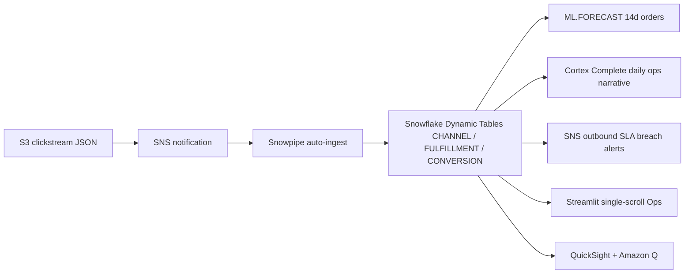

# Omnichannel Analytics — Ops Command Center
### Snowflake + Snowpipe + SNS + Claude + QuickSight | Retail/CPG

> A real-time operations dashboard — clickstream auto-ingested via Snowpipe, SLA breach alerts via SNS, and AI-generated daily briefings via Claude (Cortex COMPLETE). No tabs. Single-scroll. Built for speed.

## Key Differentiators

- **Single-scroll layout** (no tabs, no pages — entire ops view visible by scrolling)
- **Real-time ticker** hero — live order feed at the top
- **WoW growth detection** — instantly spots underperforming channels
- **Snowpipe + SNS** — event-driven clickstream ingestion
- **Claude daily briefing** — AI generates yesterday's ops narrative
- **Progress bars** for SLA compliance — visual, immediate
- **No Cortex Search** — ops needs speed, not document search

## Architecture

A real-time omnichannel ops command center built on **Snowflake** (Snowpipe, Dynamic Tables, ML.FORECAST, Cortex Complete) and **AWS** (S3, SNS, QuickSight + Amazon Q). Clickstream auto-ingests via Snowpipe; SLA breaches fan out via SNS; Claude (via Cortex Complete) writes the daily ops briefing.




## Data

| Table | Rows | Content |
|---|---|---|
| CHANNELS | 6 | In-Store, Web, Mobile App, Marketplace, Social Commerce, Phone |
| CUSTOMERS | 5,000 | APJ customers with primary channel preference |
| ORDERS | 100,000 | Multi-channel orders with fulfillment type |
| FULFILLMENTS | 100,000 | Ship/BOPIS/curbside/in-store tracking |
| WEB_SESSIONS | 500,000 | Clickstream: pages, duration, conversion |
| RETURN_POLICIES | 30 | Channel-specific return policy documents |

## Streamlit Sections (single-scroll, 10 sections)

| Section | Visual | Data Source |
|---|---|---|
| Live Order Feed | 4 metric cards (latest orders) | RAW.ORDERS |
| Channel KPIs | Large metrics per channel | CHANNEL_PERFORMANCE DT |
| Revenue Mix | Plotly donut chart (channel share) | CHANNEL_PERFORMANCE DT |
| Conversion Trend | Plotly line chart by channel | CONVERSION_METRICS DT |
| Orders by Channel | Plotly stacked area chart | CHANNEL_PERFORMANCE DT |
| WoW Growth | 6 metric cards (weekly % change) | CHANNEL_PERFORMANCE DT |
| AOV Trend | Plotly grouped bar chart (7d) | CHANNEL_PERFORMANCE DT |
| Fulfillment SLA | Progress bars + metrics per type | FULFILLMENT_PERFORMANCE DT |
| Daily Briefing | Claude-generated narrative | Cortex COMPLETE (claude-sonnet-4-5) |
| Channel Forecast | Plotly line chart (14-day) | ML FORECAST |

## QuickSight (VP Digital Persona)

3 datasets deployed via `quicksight/deploy.sh`:
- **omni-channel-performance** — revenue, orders, AOV by channel/day
- **omni-fulfillment-sla** — SLA% by type and week
- **omni-conversion-metrics** — sessions, conversion rate by channel/day

Q Topic: `omnichannel-q-topic` with channel, fulfillment, and conversion synonyms.

```bash
export AWS_ACCOUNT_ID=__AWS_ACCOUNT_ID__
export QS_DATASOURCE_ID=<your-snowflake-datasource-id>
export QS_USER_ARN=<your-quicksight-user-arn>
bash quicksight/deploy.sh
```

## Legal

This is a personal project and is **not an official Snowflake offering**.
